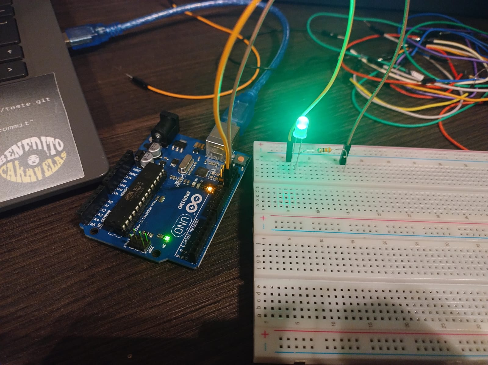
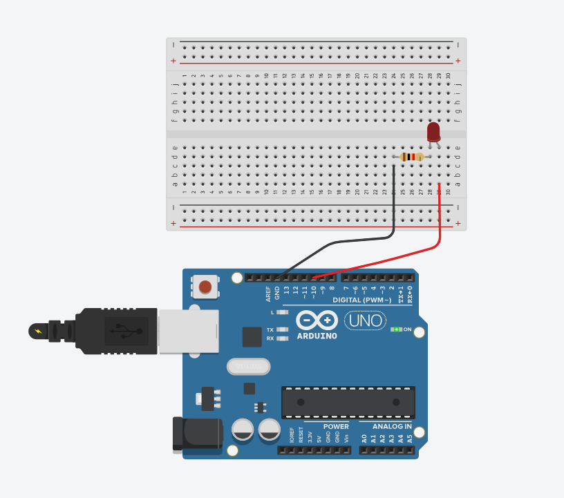

## Atividade: Piscar LED com Arduino

Aluna: Karine Victoria Rosa da Paixão <br/>
Data: 16/01/2024


### **Desafio Proposto:**
Desenvolver um código que faça o LED embutido no Arduino piscar. O tempo de acendimento e apagamento do LED foi definido conforme preferência pessoal


### **Comprovação:**
A comprovação do funcionamento foi realizada por meio de uma fotografia mostrando o Arduino conectado ao computador e o LED piscando. Seguem as evidências:


<div align="center">
 <p> Figura 1 - Led vermelho funcioando </p>

<p><b>Fonte:</b> Material elaborado pela autora. (2024)</p>
</div>


<div align="center">
 <p> Figura 2  - Foto do codigo ultilizado</p>

<p><b>Fonte:</b> Material elaborado pela autora. (2024)</p>
</div>


Como pode ser visto acima, o projeto foi realizado com sucesso, por isso foi decidido ir um pouco além e realizar uma demonstração utilizando a ferramenta do Tinkercad, que é uma plataforma virtual para testar diferentes combinações em circuitos elétricos. Ela serve para criar uma visualização do que será feito sem colocar em risco nenhum equipamento, pois tudo será testado na plataforma.

Aqui pode ser visto o desenvolvimento do projeto no Tinkercad: [Link](https://www.tinkercad.com/things/0g1wL9QVYpy-arduino-karine?sharecode=cYOVT-dJOptkcWCWgreN4KqwGzHP0s6eBazJTkZGTs4)

Diferente do desafio acima, neste foi decidido utilizar uma protoboard também. Abaixo, deixo uma demonstração visual da aplicação física do projeto no Tinkercad:

<div align="center">
 <p> Figura 3  - Arduino e protoboard fisico</p>

<p><b>Fonte:</b> Material elaborado pela autora. (2024)</p>
</div>


<div align="center">
 <p> Figura 3  - Arduino e protoboard no thinkcad</p>

<p><b>Fonte:</b> Material elaborado pela autora. (2024)</p>
</div>


Além disso, também abaixo pode ser encontrado o código usado em C/C++.


Resultado:

```cpp
// C++ code
//
void setup()
{
  pinMode(13, OUTPUT);
}

void loop()
{
  digitalWrite(13, HIGH);
  delay(1000); // Wait for 1000 millisecond(s)
  digitalWrite(13, LOW);
  delay(1000); // Wait for 1000 millisecond(s)
}

