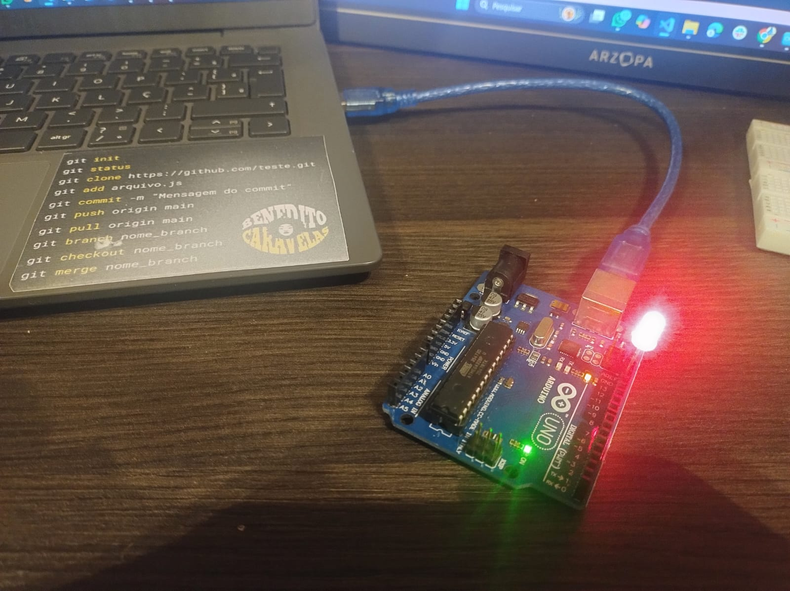
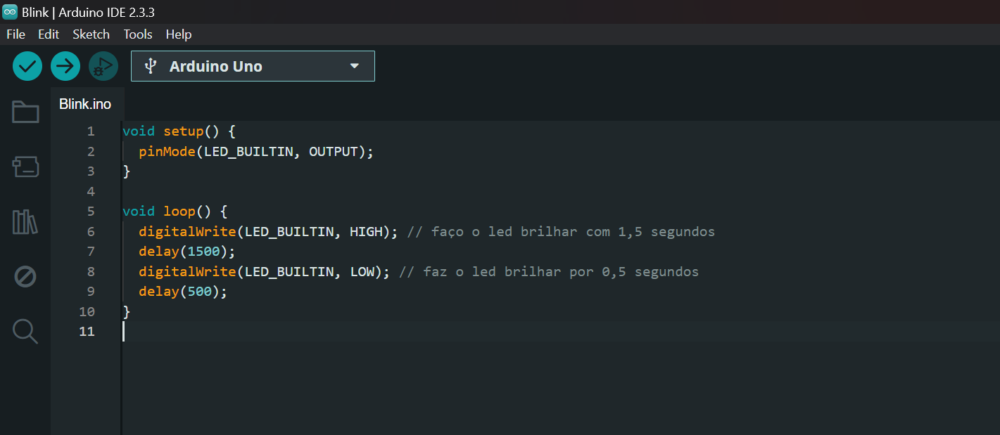

## Atividade: Piscar LED com Arduino

Aluna: Karine Victoria Rosa da Paixão
Data: 16/01/2024

### **Desafio Proposto:**
Desenvolver um código que faça o LED embutido no Arduino piscar. O tempo de acendimento e apagamento do LED foi definido conforme preferência pessoal

### **Comprovação:**
A comprovação do funcionamento foi realizada por meio de uma fotografia mostrando o Arduino conectado ao computador e o LED piscando. Seguem as evidências:

Foto do Arduino com o LED aceso: 

 
 Figura 1 - Led vermelho funcioando 

<b>Fonte:</b> Material elaborado pela autora. (2024)

 **Foto do codigo do arduino para fazer o led funcionar:**

 
 Figura 2  - Foto do codigo ultilizado

<b>Fonte:</b> Material elaborado pela autora. (2024)

